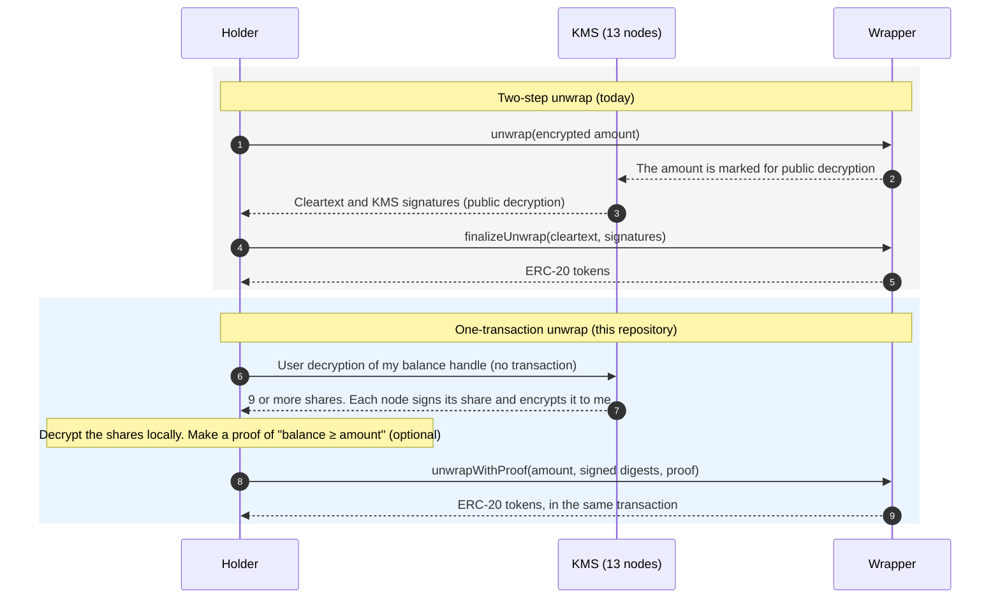
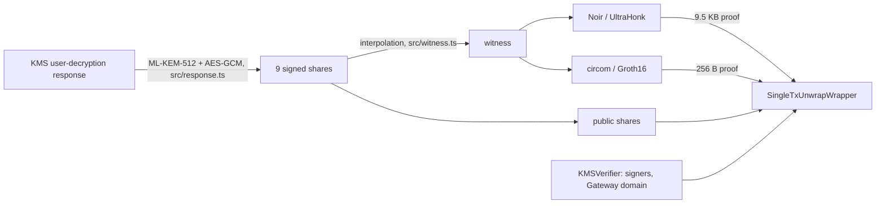

# ERC-7984 single-transaction unwrap

This research comes from the R&D lab of [Raycash](https://github.com/raycashxyz). The lab does
research to get the maximum value from the Zama FHEVM and ERC-7984.

## Why this research exists

Confidential tokens keep balances and amounts encrypted. On the [Zama](https://www.zama.ai/) FHEVM,
an [ERC-7984](https://eips.ethereum.org/EIPS/eip-7984) wrapper holds public ERC-20 tokens. In
exchange, the holder gets the same amount of confidential tokens. To get the ERC-20 tokens back, the
holder unwraps the confidential tokens.

A contract cannot read an encrypted value. For this reason, the OpenZeppelin wrapper unwraps in two
transactions:

1. The first transaction burns the encrypted amount and marks the amount for public decryption.
2. The Zama KMS decrypts the amount off-chain.
3. The second transaction does a check of the KMS signatures and sends the ERC-20 tokens.

This flow causes four problems for applications:

- **Time.** The holder sends two transactions and waits between them. On Ethereum mainnet, we
  measured a median time of approximately 2 minutes between the two transactions (2026-10).
- **State.** The wallet must keep a record of each open request. The wallet must also complete or
  recover each request.
- **Composability.** Other contracts cannot use the ERC-20 tokens in the same transaction. For
  example, one transaction cannot unwrap and swap, or unwrap and pay.
- **Gas sponsorship.** A gas sponsor cannot know if a request can complete. Thus, the sponsor pays
  for the first transaction without a check.

A holder can read their own balance without a transaction. This operation is a *user decryption*,
and the KMS answers in approximately one second. This research asks one question: can a contract use
the user decryption directly, and thus unwrap in one transaction?

The answer is yes. This repository shows three methods and measures their gas cost. It also shows
that the method works for all decryptions, not only for tokens.

## Summary

The three methods use the same user decryption. They are different in the data that goes on-chain.

| method | data on-chain | balance | time to make the proof | gas today | gas after Glamsterdam (estimate) |
|---|---|---|---|---|---|
| OpenZeppelin two-step `unwrap` → `finalizeUnwrap` (baseline) | — | private | — | 841k (2 transactions) | 1.55M |
| `unwrapWithProof`, **Noir / UltraHonk** | signed digests + 9.5 KB proof | private | 0.7 s | 1.31M | 1.85M |
| `unwrapWithProof`, **circom / Groth16** | signed digests + 256 B proof | private | 3.6 s (rapidsnark) | **827k** | **1.37M** |
| `unwrapAllWithShares`, **no proof** (full balance) | the shares | public | — | **632k** | **1.17M** |

The three methods are atomic. Thus, other contracts can use them. One transaction can
[unwrap and swap](#composability-unwrap-and-swap-in-one-transaction) for 873k gas with the circom
proof. The two-step flow needs four transactions and 957k gas for the same result.

The code uses the latest Zama code. Refer to [Built on the latest Zama code](#built-on-the-latest-zama-code).

> **Status: research prototype.** Nobody audited this code. The circom trusted setup in this
> repository has one contribution only. Use it for development only.

## Contents

- [How the method works](#how-the-method-works)
- [The circuits](#the-circuits)
- [Gas](#gas)
- [Composability: unwrap and swap in one transaction](#composability-unwrap-and-swap-in-one-transaction)
- [Use for all decryptions and for ZK proofs](#use-for-all-decryptions-and-for-zk-proofs)
- [Built on the latest Zama code](#built-on-the-latest-zama-code)
- [Security model and limits](#security-model-and-limits)
- [Repository layout](#repository-layout)
- [How to run the tests](#how-to-run-the-tests)
- [Next steps](#next-steps)

## How the method works

### The observation

In a user decryption, each KMS node sends its *share* of the plaintext to the holder. The node
encrypts the share to a single-use key of the holder. Before the encryption, the node signs the
share. The signature covers the plaintext share and the data that the share belongs to: the
ciphertext handle, the holder, and the request key.

Thus, the decrypted shares contain their own authentication. A contract can do a check of each
signature with `ecrecover`. Then, the contract can use the balance of the holder in the transaction
that burns it.



### The results of one transaction

- **Atomicity and composability.** Other calls can include the unwrap: unwrap and swap, unwrap and
  repay, or unwrap and pay. If a later step fails, the unwrap also reverts.
- **No open requests.** The wallet does not keep a record of requests. No request stays open if the
  holder does not send a second transaction.
- **Simulation.** Any person can simulate the unwrap with `eth_call` before the transaction. For
  example, a gas sponsor can know that the unwrap succeeds before the sponsor pays.

### What a KMS node signs

For a user decryption of a `euint64`, each node signs with secp256k1 ECDSA over SHA-256
([`ecdsa_v0::seal`](https://github.com/zama-ai/kms/blob/v0.15.0-1/core/service/src/cryptography/signcryption/ecdsa_v0.rs),
[`signcrypt_plaintext`](https://github.com/zama-ai/kms/blob/v0.15.0-1/core/service/src/cryptography/signcryption/mod.rs)):

```
digest = SHA-256( "USER_DEC" ‖ bincode(SigncryptionPayload { plaintext: share, link }) ‖ user ‖ H(enc_key) )
link   = EIP-712( UserDecryptionLinker(publicKey, [handle], user) )   on the Gateway "Decryption" domain
```

Then, the node encrypts the payload and the signature to the single-use ML-KEM-512 key of the
holder. The byte layout is in [`docs/kms-formats.md`](docs/kms-formats.md).

The shares are Shamir shares of degree t = 4 over the Galois ring
GR(2^128, 4) = Z<sub>2^128</sub>[X] / (X⁴ + X + 1). The KMS has n = 13 nodes, and each node has one
share. The shared secret contains the value, encoded with TFHE.

### What the contract checks

[`SingleTxUnwrapWrapper`](contracts/SingleTxUnwrapWrapper.sol) extends the OpenZeppelin
`ERC7984ERC20Wrapper`. The two one-transaction methods do these checks with
[`KmsUserDecryption`](contracts/KmsUserDecryption.sol):

1. **Link.** The contract calculates the `link` from its own state. It uses the current balance
   handle of the holder (`confidentialBalanceOf(from)`), `from`, the hash of the request key, and the
   Gateway domain. The contract reads the Gateway domain from the Zama `KMSVerifier`. Shares of a
   different handle, holder, or request do not agree with this `link`.
2. **Signatures.** The contract needs 9 = 2t + 1 signatures from different nodes. It recovers each
   signer with one `ecrecover` and compares the signer with `KMSVerifier.getKmsSigners()`. Party p
   is signer p − 1. The contract reads the signer set at each call. Thus, a change of signers has an
   immediate effect.
3. **Reconstruction.** This step is different for each method:
   - **`unwrapAllWithShares`.** The 9 shares are public in the calldata. The contract calculates the
     digests from the shares and does the check of step 2 on them. Then, it makes sure that the 9
     shares are on one polynomial of degree 4. The prover supplies the coefficients, thus the
     contract does not calculate ring inverses. Last, the contract decodes the constant term (TFHE)
     to get the balance.
   - **`unwrapWithProof`.** The shares stay private. The contract does the check of step 2 on the 9
     digests. Then, it verifies a ZK proof. The proof shows that the private shares have these
     digests, are on one polynomial of degree 4, and decode to a value ≥ `amount`.
4. **Release.** The contract burns `amount`. For the method without a proof, the amount is the full
   balance. Then, the contract sends `amount × rate()` of the underlying token.

The method uses 9 shares for this reason: 5 points fix a polynomial of degree 4. If 4 or fewer nodes
collude, 9 shares on one polynomial include at least 5 shares from honest nodes. This limit is the
same as the collusion limit of the Zama KMS. The check accepts no errors, thus it is stricter than a
decode with error correction. The check also takes t and n from the signer set, and not from the
responses that the nodes sign.



## The circuits

The two circuits prove the same statement. They have the same 31 public inputs in the same
sequence. Thus, the wrapper makes one vector (`KmsUserDecryption.publicInputs`) for the two circuits.

| public input | count | source |
|---|---|---|
| link (two 128-bit halves) | 2 | the contract calculates it from the current balance handle |
| user | 1 | the contract (`from`) |
| amount | 1 | the call |
| parties | 9 | the call, after the signature check |
| digests (two halves each) | 18 | the call, after the signature check |

The private inputs are the 9 shares, the 20 ring elements of the polynomial, and H(enc_key). Each
signed digest already contains H(enc_key).

|  | [Noir / UltraHonk](circuits/noir/src/main.nr) | [circom / Groth16](circuits/circom/unwrap.circom) |
|---|---|---|
| size | 261,403 gates (2^18 domain) | 1,926,807 constraints |
| SHA-256 part | 63 compressions × 3,946 = 249k (95%) | 9 × 210,691 = 1.90M (98%) |
| time to make the proof (Apple M4 Max) | 0.70 s (+0.13 s for the witness) | 3.6 s with rapidsnark (+ approximately 3 s for the WASM witness). 22 s with snarkjs, from start to end |
| proving key | none (universal SRS) | 1.1 GB, specific to the circuit |
| trusted setup | none, other than the universal SRS | phase 2 for each circuit (development setup in this repository) |
| proof | 9,536 bytes | 256 bytes |
| on-chain verification | 747k gas | 406k gas (approximately 190k for the 31 public inputs) |

The KMS message format sets the 63 SHA-256 compressions (9 messages × 7 blocks). Thus, SHA-256 is
most of the cost in the two circuits. All other parts use approximately 12k UltraHonk gates. These
parts are the ring arithmetic, the check without errors, and the TFHE decode.

The two proof systems have different advantages:

- UltraHonk makes a proof quickly and needs no key for each circuit. But the verification of its
  proof costs 3 to 4 times more gas.
- Groth16 verification costs less gas. But the prover needs a proving key of approximately 1 GB and
  a phase-2 ceremony.

The holder must make the proof on their own device, because the witness contains the plaintext
shares.

## Gas

`pnpm gas` ([`test/gas.test.ts`](test/gas.test.ts)) measures the gas. The test uses the Zama host
contracts and a KMS with 13 nodes and threshold 7. It unwraps 400 USDC. Each method has its own new
holder.

| method | transactions | unwrap | proof verification | proof calldata | total |
|---|---|---|---|---|---|
| two-step `unwrap` → `finalizeUnwrap` (baseline) | 2 | 308,999 + 532,122 | — | — | **841,121** |
| `unwrapWithProof`, Noir/UltraHonk | 1 | 417,117 | 746,915 | 147,152 | **1,311,184** |
| `unwrapWithProof`, circom/Groth16 | 1 | 417,117 | 406,008 | 4,060 | **827,185** |
| `unwrapAllWithShares`, no proof | 1 | 631,907 | — | — | **631,907** |

The columns contain these costs:

- **unwrap.** All the gas of the transaction other than the proof: the intrinsic gas, the calldata
  without the proof, the signature checks, the burn, and the transfer. For the two-step method, the
  two values are the `unwrap` transaction and the `finalizeUnwrap` transaction.
- **proof verification.** The call to the verifier. For Groth16, this value includes the adapter.
- **proof calldata.** The calldata of the proof: 9,536 bytes for UltraHonk and 256 bytes for Groth16.

In this test, the proof methods use a mock verifier. The test measures the real verifiers
separately, with real proofs. The *unwrap* column is the cost of the mock transaction without the
mock verification. [`test/unwrap.test.ts`](test/unwrap.test.ts) sends the same transactions with real
proofs.

The UltraHonk verifier uses 747k gas. This total contains 59 `ecMul` operations (354k), one pairing
(113k), and approximately 272k for the sumcheck arithmetic. The Groth16 verifier uses one pairing
with 4 pairs (181k) and one `ecMul` for each public input.

### After Glamsterdam

[Glamsterdam](https://eips.ethereum.org/EIPS/eip-7773) activates on Sepolia on 2026-10-06. The
mainnet date is not set. Glamsterdam does not change the cost of opcodes or precompiles
([EIP-7904](https://eips.ethereum.org/EIPS/eip-7904) is now informational). Thus, the verifiers have
the same cost. Glamsterdam changes the cost of state:

- A new storage slot costs 110,020 gas, not 22,100 ([EIP-8037](https://eips.ethereum.org/EIPS/eip-8037),
  [EIP-8038](https://eips.ethereum.org/EIPS/eip-8038)).
- The intrinsic gas decreases to 15,000 ([EIP-2780](https://eips.ethereum.org/EIPS/eip-2780)).
- The calldata floor increases ([EIP-7976](https://eips.ethereum.org/EIPS/eip-7976)). The floor has
  no effect on these transactions.

The gas test replays each transaction with the tevm prestate tracer. Then, it calculates the new cost
of the storage writes of the transaction ([`test/setup/glamsterdam.ts`](test/setup/glamsterdam.ts)).

| method | today | after Glamsterdam | new slots |
|---|---|---|---|
| two-step (2 transactions) | 841k | 1,549k | 8 |
| Noir/UltraHonk (1 transaction) | 1,311k | 1,850k | 6 |
| circom/Groth16 (1 transaction) | 827k | 1,366k | 6 |
| no proof (1 transaction) | 632k | 1,170k | 6 |

Each FHE ACL `allow` writes a new slot. Thus, after the fork, state is most of the cost. A
one-transaction unwrap writes 6 new slots: 5 ACL entries and the ERC-20 balance of the recipient.
The two-step flow writes 8 new slots. The 2 extra slots are the request and the public-decryption
flag. Thus, the difference becomes smaller. Groth16 becomes 12% less expensive than the baseline.
The additional cost of UltraHonk decreases from 56% to 19%.

## Composability: unwrap and swap in one transaction

[`contracts/examples/UnwrapAndSwap.sol`](contracts/examples/UnwrapAndSwap.sol):

```solidity
function unwrapAndSwap(
    SingleTxUnwrapWrapper wrapper,
    uint64 amount,
    SingleTxUnwrapWrapper.SignedDigests calldata signed,
    bytes calldata proof,
    ISwapPool pool,
    IERC20 tokenOut,
    uint256 minAmountOut
) external returns (uint256 amountOut) {
    wrapper.unwrapWithProof(msg.sender, address(this), amount, signed, proof);
    IERC20 underlying = IERC20(wrapper.underlying());
    uint256 released = amount * wrapper.rate();
    underlying.forceApprove(address(pool), released);
    amountOut = pool.swap(underlying, released, minAmountOut, msg.sender);
}
```

The holder makes the router an ERC-7984 operator one time. After that, each call unwraps only the
balance of the caller. The KMS decryption is bound to the current handle of the caller. Thus, nobody
can use the router to replay the decryption of a different holder.

[`test/composability.test.ts`](test/composability.test.ts) shows two results:

- One transaction changes confidential USDC to WETH, with a real UltraHonk proof.
- If the swap gives less than `minAmountOut`, the unwrap also reverts. The balance handle does not
  change.

With the two-step flow, the USDC arrives in a later transaction. Thus, the swap needs two more
transactions: the approval and the swap. Also, the price can change between the transactions.

## Use for all decryptions and for ZK proofs

The method is not specific to tokens. A user decryption gives node-signed shares for each handle
that the user can decrypt. The shares are bound to that handle and to that user. Thus, a contract can
act on a fact about an encrypted value, in one transaction:

- **All types.** For each type, three items change: the `fhe_type` byte in the signed message, the
  number of ring elements in each share, and the decode.
- **All conditions.** The last step of the circuit is `value ≥ amount`. You can replace it with an
  equality, a range, a membership test, or a function of more than one decrypted handle.
- **All consumers.** The wrapper is one example. A vault can release collateral, and an order book
  can settle a sealed order. A governance contract can accept a confidential vote weight.

The KMS signature also changes an FHE ciphertext into an authenticated private input for a ZK proof.
The first two steps of the circuits prove one statement. The private shares are the shares that the
KMS signed for handle H, and they reconstruct to the value v. You can use these steps again in other
circuits. They bring the plaintext of an FHE handle into a ZK statement, and the plaintext stays
private.

- **Private thresholds on all chains.** Prove that an encrypted balance or score is ≥ X, for access,
  credit, or compliance. The proof does not show the value, and no public decryption is necessary.
- **FHE to ZK privacy pools.** Move value from an encrypted balance into the commitment of a shielded
  pool, in one transaction. The amount stays hidden in the two systems.
- **Facts on other chains.** Only `ecrecover` is necessary to verify the signed digests. Thus, a
  contract on a different chain can accept the fact "handle H on chain A decrypts to ≥ X". The
  contract must know the KMS signer set.
- **Combined statements.** Prove relations between more than one encrypted value in one proof. For
  example, compare two balances, or a balance and a limit.

## Built on the latest Zama code

| component | version | use |
|---|---|---|
| zama-ai/kms | v0.15.0-1 (latest pre-release), v0.14.2 (latest release), v0.12 (the Sepolia fixture) | We compared the signed-message format, the response format, and the hybrid encryption in the three versions. They are identical. In v0.15.0-1, user decryption uses the frozen `ecdsa_v0` layout on purpose ([`signcrypt_plaintext`](https://github.com/zama-ai/kms/blob/v0.15.0-1/core/service/src/cryptography/signcryption/mod.rs)). An upstream test locks the format of `SigncryptionPayload` V0. |
| `@fhevm/host-contracts` | 0.10.0 (latest) | The tests run on these contracts: `ACL`, `FHEVMExecutor`, `KMSVerifier`, and `InputVerifier`. |
| `@fhevm/solidity` | 0.11.1 | `FHE` and `ZamaEthereumConfig`. OpenZeppelin 0.5.3 uses this version. Version 0.13 exists, but two versions together give two `euint64` types that are not compatible. |
| `@openzeppelin/confidential-contracts` | 0.5.3 (latest) | `ERC7984ERC20Wrapper`, with no changes. The baseline is the OpenZeppelin two-step flow. |
| `@zama-fhe/relayer-sdk` | 0.4.4 (latest) | Encryption, public decryption, and user decryption in the tests, through the mock instance (`fhevm-tevm-mocks` 0.4.1). |

**Real KMS data.** [`fixtures/sepolia-2025-10/user-decryption.json`](fixtures/sepolia-2025-10/user-decryption.json)
is a real user decryption on Sepolia, with 13 nodes. It contains the 9 node responses from the
relayer and the ML-KEM key pair of the request. [`test/sepolia.test.ts`](test/sepolia.test.ts) does
these steps:

1. It decrypts the responses with the TypeScript client. The client uses ML-KEM-512 and AES-GCM from
   `@noble`, and not the KMS WASM.
2. It verifies the 9 signatures on-chain, with the real Sepolia signer set.
3. It reconstructs the balance (200 test USDC) in Solidity.
4. It verifies real UltraHonk and Groth16 proofs of the decryption.

Earlier Rust (SP1) and Go (gnark) implementations of the same statement calculated the expected
values of the test. These implementations are independent of this repository.

The client does not use the KMS code base. [`src/response.ts`](src/response.ts) parses the bincode
payloads and decrypts the shares in approximately 150 lines.

## Security model and limits

- **Trust.** The trust model is the same as the model of the Zama KMS. Integrity and privacy stay
  correct if 4 or fewer of the 13 nodes collude. The contract reads the signer set and the Gateway
  domain from `KMSVerifier` at each call.
- **Replay.** The shares are bound to the current balance handle, the holder, and the request key. A
  burn changes the handle. Thus, one decryption can unwrap one time only.
- **Transfers to the holder.** A transfer to the holder also changes the handle of the holder. Thus, a
  decryption that the holder did not use yet becomes stale. The holder must then decrypt again, in
  approximately one second. A separate pending balance can prevent this problem. But a merge of the
  pending balance needs a second transaction, and this repository removes the second transaction.
- **Privacy.** With a proof, only the amount is public, as for all unwraps. The method without a
  proof makes the shares public, thus it also makes the balance public. Use this method to unwrap the
  full balance. Each user gets all the shares of their own decryption. Thus, the publication of the
  shares shows the value and nothing that the user cannot already publish.
- **Partial reveals are not safe.** It can seem less expensive to show only t of the 9 shares and
  prove the other shares. But each node knows its own share of each decryption. Thus, t public
  shares and the share of one corrupt node give t + 1 points. These points give the balance. Each
  public share decreases the collusion limit of the Zama KMS by one.
- **Local proofs.** The witness contains the plaintext shares. Thus, the holder must make the proof on
  their own device.
- **Trusted setup.** UltraHonk uses a universal SRS. The Groth16 key in this repository uses the
  [PSE perpetual powers of tau](https://github.com/privacy-scaling-explorations/perpetualpowersoftau)
  (2^21, 80 contributions) and a phase 2 with one contribution. Use this key for development only.
- **Fixed parameters.** The circuits and `KmsUserDecryption` use n = 13 and t = 4. This is the KMS
  configuration of the Zama networks today.

## Repository layout

```
contracts/
  SingleTxUnwrapWrapper.sol     ERC-7984 wrapper with unwrapWithProof and unwrapAllWithShares
  KmsUserDecryption.sol         link, share digest, signature checks, public inputs, reconstruction
  KmsVerifierView.sol           reads of the Zama KMSVerifier at each call
  IUnwrapProofVerifier.sol      the verifier interface
  verifiers/                    the generated UltraHonk and Groth16 verifiers, and the circom adapter
  examples/UnwrapAndSwap.sol    the composability example
  mocks/                        test tokens, AMM, mock verifier, and the OpenZeppelin two-step baseline
circuits/
  noir/                         the UltraHonk circuit
  circom/                       the Groth16 circuit
src/                            TypeScript client: decrypts the KMS response, makes the witness, makes the proof
test/                           vitest on tevm, with the Zama host contracts (fhevm-tevm-mocks)
fixtures/sepolia-2025-10/       a real Sepolia user decryption and real proofs of it
scripts/                        builds the circuits and the verifiers, and makes proofs from a KMS response
docs/kms-formats.md             the byte layouts of all the data that the KMS sends and signs
```

## How to run the tests

You need Node 22 or later, and pnpm.

```bash
pnpm install      # install the dependencies
pnpm compile      # compile the contracts and generate the typed deployers
pnpm test         # run the 37 tests (3 of them need the circuit toolchains)
pnpm gas          # show the gas tables of this README
```

The repository contains the generated verifiers and the Sepolia proofs. Thus, `pnpm test` does not
need the circuit toolchains. To make the proofs yourself, do these steps:

```bash
# Noir / UltraHonk: nargo 1.0.0-rc.2 and bb 6.0.0-rc.2 (install them with noirup and bbup)
pnpm build:noir
pnpm prove fixtures/sepolia-2025-10/user-decryption.json noir /tmp/noir-proof.json

# circom / Groth16: circom 2.2.x. The setup takes approximately 10 minutes and 30 GB of RAM.
# The proving key is 1.1 GB.
pnpm build:circom
RAPIDSNARK=/path/to/rapidsnark/bin/prover \
  pnpm prove fixtures/sepolia-2025-10/user-decryption.json circom /tmp/circom-proof.json
```

If `nargo` and `bb` are on `PATH` and `circuits/circom/build/unwrap.zkey` exists, `pnpm test` also
runs the end-to-end tests. These tests use a current FHEVM balance handle, KMS shares signed for it, a
real proof, and the on-chain unwrap. They also do the unwrap and swap.

## Next steps

- **A burn with fewer operations.** The proof already shows that the balance is sufficient for the
  amount. Thus, the burn does not need the OpenZeppelin check and select, or ACL entries for the
  burned amount. This change saves approximately 98k gas today and 274k gas after Glamsterdam. But
  OpenZeppelin keeps the balances private. Thus, the change needs a hook in the token.
- **Less expensive UltraHonk verification.** The proof is zero-knowledge. Thus, a server can wrap it
  into a Groth16 proof and learn nothing. The verification then costs approximately 200k gas. Only
  that server keeps the large key.
- **Other types and conditions.** Refer to
  [Use for all decryptions and for ZK proofs](#use-for-all-decryptions-and-for-zk-proofs).

## Licenses

The code in this repository has the MIT license. Third-party parts keep their licenses. The circom
circuit includes [circomlib](https://github.com/iden3/circomlib) (GPL-3.0). The generated Groth16
verifier comes from the snarkjs template (GPL-3.0). The generated UltraHonk verifier comes from
Barretenberg (Apache-2.0).
