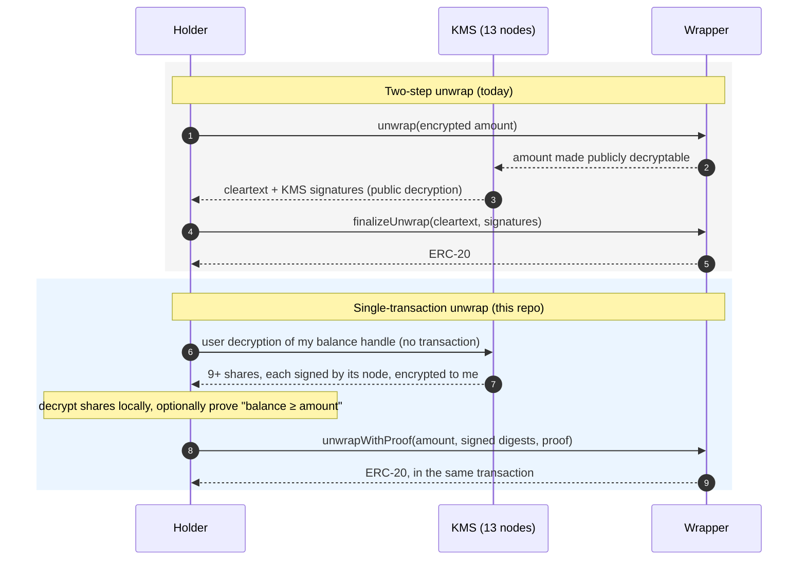
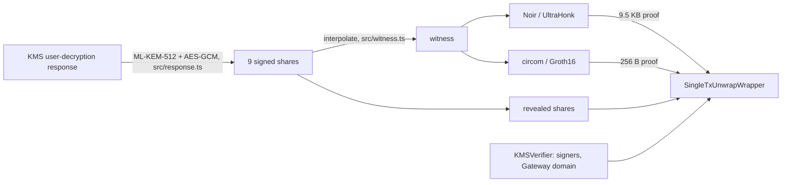

# ERC-7984 single-transaction unwrap

Unwrap a confidential [ERC-7984](https://eips.ethereum.org/EIPS/eip-7984) token in **one
transaction**, using a [Zama](https://www.zama.ai/) KMS **user decryption** of the holder's balance as
the proof that the balance covers the amount. Three ways to consume that decryption on-chain:

| path | what goes on-chain | balance | proving | gas today | gas after Glamsterdam (est.) |
|---|---|---|---|---|---|
| OpenZeppelin two-step `unwrap` → `finalizeUnwrap` (baseline) | — | private | — | 841k (2 tx) | 1.55M |
| `unwrapWithProof`, **Noir / UltraHonk** | signed digests + 9.5 KB proof | private | 0.7 s | 1.31M | 1.85M |
| `unwrapWithProof`, **circom / Groth16** | signed digests + 256 B proof | private | 3.6 s (rapidsnark) | **827k** | **1.37M** |
| `unwrapAllWithShares`, **no proof** (whole balance) | the shares themselves | revealed | — | **632k** | **1.17M** |

All three are atomic, so they compose: [unwrap and swap in one transaction](#composability-unwrap-and-swap-in-one-transaction)
costs 873k gas with the circom proof, against 957k for the four transactions the two-step flow needs.

Everything here runs against the latest Zama code: see [Built on the latest Zama code](#built-on-the-latest-zama-code).

> **Status: research prototype, not audited.** The circom trusted setup in this repo is a
> single-contribution development setup.

## Contents

- [The idea](#the-idea)
- [How it works](#how-it-works)
- [The circuits](#the-circuits)
- [Gas](#gas)
- [Composability: unwrap and swap in one transaction](#composability-unwrap-and-swap-in-one-transaction)
- [Beyond ERC-7984: any decryption, and FHE handles inside ZK proofs](#beyond-erc-7984-any-decryption-and-fhe-handles-inside-zk-proofs)
- [Built on the latest Zama code](#built-on-the-latest-zama-code)
- [Security model and trade-offs](#security-model-and-trade-offs)
- [Repository layout](#repository-layout)
- [Running it](#running-it)
- [Next steps](#next-steps)

## The idea

Today a confidential token unwraps in two transactions, because the contract cannot read the
encrypted amount it burns:

1. `unwrap` burns the encrypted amount and marks it publicly decryptable;
2. the KMS publicly decrypts it, off-chain;
3. `finalizeUnwrap` checks the KMS signatures over the cleartext and sends the ERC-20.

The holder, however, can already read their own balance without any transaction: that is a **user
decryption**, which the KMS answers in about a second. Each KMS node returns its *share* of the
plaintext, encrypted to a single-use key of the holder, and — the observation this repo builds on —
**signed by the node before it is encrypted**. The node's ECDSA signature covers the plaintext share
*and* what it is a share of (the ciphertext handle, the holder, the request key). So the decrypted
shares carry their own authentication, checkable on-chain with `ecrecover`, and a contract can act on
the holder's balance in the same transaction that burns it.



What one transaction buys:

- **Atomicity, hence composability.** The unwrap can sit inside any other call: unwrap and swap, unwrap
  and repay, unwrap and pay a merchant. If the rest fails, the unwrap rolls back with it.
- **No pending state.** No unwrap request to track, finalize, or recover if the second transaction
  never comes. The two-step flow took a median of about 2 minutes between `unwrap` and
  `finalizeUnwrap` on Ethereum mainnet when we measured it (2026-10).
- **Simulation.** Anyone can `eth_call` the unwrap before it is sent and know it succeeds — e.g. a gas
  sponsor deciding whether to pay for it, instead of sponsoring an `unwrap` request blind.

## How it works

### What a KMS node signs

For a user decryption of a `euint64`, each node signs, with secp256k1 ECDSA over SHA-256
([`ecdsa_v0::seal`](https://github.com/zama-ai/kms/blob/v0.15.0-1/core/service/src/cryptography/signcryption/ecdsa_v0.rs),
[`signcrypt_plaintext`](https://github.com/zama-ai/kms/blob/v0.15.0-1/core/service/src/cryptography/signcryption/mod.rs)):

```
digest = SHA-256( "USER_DEC" ‖ bincode(SigncryptionPayload { plaintext: share, link }) ‖ user ‖ H(enc_key) )
link   = EIP-712( UserDecryptionLinker(publicKey, [handle], user) )   on the Gateway "Decryption" domain
```

and then encrypts `payload ‖ signature` to the holder's single-use ML-KEM-512 key. `docs/kms-formats.md`
has the byte layout. The shares are Shamir shares of degree t = 4 over the Galois ring
GR(2^128, 4) = Z<sub>2^128</sub>[X] / (X⁴ + X + 1), one per node of the n = 13 node KMS; the value is
TFHE-encoded in the shared secret.

### What the contract checks

[`SingleTxUnwrapWrapper`](contracts/SingleTxUnwrapWrapper.sol) extends OpenZeppelin's
`ERC7984ERC20Wrapper`. Both one-transaction unwraps check, through
[`KmsUserDecryption`](contracts/KmsUserDecryption.sol):

1. **Binding.** It recomputes `link` from **its own state**: the holder's *live* balance handle
   (`confidentialBalanceOf(from)`), `from`, the request key hash, and the Gateway domain it reads from
   Zama's `KMSVerifier`. Shares of any other handle, holder or request don't match.
2. **Signatures.** 9 = 2t + 1 signatures from distinct nodes, each recovered with one `ecrecover`
   against `KMSVerifier.getKmsSigners()` (party p is signer p − 1), read live so a signer rotation
   applies at once.
3. **Reconstruction**, which differs per path:
   - **`unwrapAllWithShares`**: the 9 shares come in the clear. The contract hashes them into the
     digests it checks in step 2, requires all 9 to lie on one degree-4 polynomial (prover-supplied
     coefficients, so no ring inversions on-chain), and TFHE-decodes the constant term into the balance.
   - **`unwrapWithProof`**: the shares stay private. The contract checks the signatures over the 9
     digests, then verifies a ZK proof that the hidden shares hash to exactly those digests, lie on one
     degree-4 polynomial, and decode to a value ≥ `amount`.
4. **Release.** It burns `amount` (the whole balance for the no-proof path) and transfers
   `amount × rate()` of the underlying.

Why 9 shares on one polynomial: a degree-4 polynomial is fixed by any 5 points, so 9 consistent shares
include at least 5 from honest nodes when up to t = 4 nodes collude — the same corruption bound as
Zama's KMS. The zero-error check is stricter than error-correcting decoding, and it takes t and n from
the signer set, never from the (node-signed) responses.



## The circuits

Both circuits prove the same statement, with the same 31 public inputs in the same order, so the
wrapper builds one vector (`KmsUserDecryption.publicInputs`) for either:

| public input | count | from |
|---|---|---|
| link (two 128-bit halves) | 2 | the contract, from the live balance handle |
| user | 1 | the contract (`from`) |
| amount | 1 | the call |
| parties | 9 | the call, then signature-checked |
| digests (two halves each) | 18 | the call, then signature-checked |

Private: the 9 shares, the polynomial's 20 ring elements, and H(enc_key) (each signed digest already
commits to it).

|  | [Noir / UltraHonk](circuits/noir/src/main.nr) | [circom / Groth16](circuits/circom/unwrap.circom) |
|---|---|---|
| size | 261,403 gates (2^18 domain) | 1,926,807 constraints |
| of which SHA-256 | 63 compressions × 3,946 = 249k (95%) | 9 × 210,691 = 1.90M (98%) |
| prove (Apple M4 Max) | 0.70 s (+0.13 s witness) | 3.6 s rapidsnark (+~3 s WASM witness); 22 s with snarkjs end to end |
| proving key | none: universal SRS | 1.1 GB, circuit-specific |
| trusted setup | none beyond the universal SRS | per-circuit phase 2 (dev setup here) |
| proof | 9,536 bytes | 256 bytes |
| on-chain verify | 747k gas | 406k gas (of which ~190k for the 31 public inputs) |

The 63 SHA-256 compressions (9 messages × 7 blocks) are fixed by the KMS's message format, so they
dominate both circuits. Everything else — ring arithmetic, the zero-error check, the TFHE decode — is
about 12k UltraHonk gates.

The trade-off is plain: UltraHonk proves fast with no per-circuit key to distribute, but its proof
costs 3–4× more to verify. Groth16 verifies cheaply but needs a ~1 GB proving key on the prover's
machine and a phase-2 ceremony. Proving has to happen on the holder's device: the witness contains
the plaintext shares.

## Gas

`pnpm gas` ([`test/gas.test.ts`](test/gas.test.ts)), on Zama's host contracts with a 13-node,
threshold-7 KMS, 400 USDC unwrapped, one fresh holder per path:

| transaction | gas |
|---|---|
| two-step: `unwrap` | 308,999 |
| two-step: `finalizeUnwrap` (7-of-13 KMS signatures) | 532,122 |
| **two-step total (2 tx)** | **841,121** |
| `unwrapWithProof`, mock verifier | 424,036 |
| + UltraHonk verify | 746,915 |
| + UltraHonk proof calldata (9,536 B) | 147,152 |
| **`unwrapWithProof`, Noir/UltraHonk (1 tx)** | **1,311,184** |
| + Groth16 verify (incl. adapter) | 406,008 |
| + Groth16 proof calldata (256 B) | 4,060 |
| **`unwrapWithProof`, circom/Groth16 (1 tx)** | **827,185** |
| **`unwrapAllWithShares`, no proof (1 tx)** | **631,907** |
| two-step unwrap + approve + swap (4 tx) | 957,221 |
| `unwrapAndSwap`, Noir/UltraHonk (1 tx) | 1,356,807 |
| `unwrapAndSwap`, circom/Groth16 (1 tx) | 872,808 |

The proof paths run against a mock verifier; the real verifiers' cost is measured separately on real
proofs and swapped in (`unwrap − mock verify + real verify + proof calldata`).
[`test/unwrap.test.ts`](test/unwrap.test.ts) runs the same transactions with real proofs end to end.

Where the UltraHonk verifier's 747k goes: 59 `ecMul` (354k) and one pairing (113k) for the batched
opening, ~272k of sumcheck arithmetic. The Groth16 verifier is one 4-pair pairing (181k) plus one
`ecMul` per public input.

### After Glamsterdam

[Glamsterdam](https://eips.ethereum.org/EIPS/eip-7773) (Sepolia fork 2026-10-06, mainnet date not set)
does not reprice opcodes or precompiles ([EIP-7904](https://eips.ethereum.org/EIPS/eip-7904) became
informational), so the verifiers cost the same. It does reprice state: a new storage slot goes from
22,100 to 110,020 gas ([EIP-8037](https://eips.ethereum.org/EIPS/eip-8037),
[EIP-8038](https://eips.ethereum.org/EIPS/eip-8038)), intrinsic gas drops to 15,000
([EIP-2780](https://eips.ethereum.org/EIPS/eip-2780)), and the calldata floor rises
([EIP-7976](https://eips.ethereum.org/EIPS/eip-7976), not binding for these transactions). The gas test
replays each transaction with tevm's prestate tracer and reprices its storage writes
([`test/setup/glamsterdam.ts`](test/setup/glamsterdam.ts)):

| path | today | after Glamsterdam | new slots |
|---|---|---|---|
| two-step (2 tx) | 841k | 1,549k | 8 |
| Noir/UltraHonk (1 tx) | 1,311k | 1,850k | 6 |
| circom/Groth16 (1 tx) | 827k | 1,366k | 6 |
| no proof (1 tx) | 632k | 1,170k | 6 |

Every FHE ACL `allow` writes a fresh slot, so state dominates after the fork. A one-transaction unwrap
writes 6 (5 ACL entries + the recipient's ERC-20 balance), the two-step flow 8 (the request and the
public-decryption flag on top), so the gap closes: Groth16 becomes 12% cheaper than the baseline,
UltraHonk's premium shrinks from +56% to +19%.

## Composability: unwrap and swap in one transaction

[`contracts/examples/UnwrapAndSwap.sol`](contracts/examples/UnwrapAndSwap.sol):

```solidity
function unwrapAndSwap(
    SingleTxUnwrapWrapper wrapper,
    uint64 amount,
    SingleTxUnwrapWrapper.SignedDigests calldata signed,
    bytes calldata proof,
    ISwapPool pool,
    IERC20 tokenOut,
    uint256 minAmountOut
) external returns (uint256 amountOut) {
    wrapper.unwrapWithProof(msg.sender, address(this), amount, signed, proof);
    IERC20 underlying = IERC20(wrapper.underlying());
    uint256 released = amount * wrapper.rate();
    underlying.forceApprove(address(pool), released);
    amountOut = pool.swap(underlying, released, minAmountOut, msg.sender);
}
```

The holder makes the router an ERC-7984 operator once; each call then unwraps the caller's own
balance. The KMS decryption is bound to the caller's live handle, so nobody else's decryption can be
replayed through the router. [`test/composability.test.ts`](test/composability.test.ts) shows:

- confidential USDC → WETH in one transaction, with a real UltraHonk proof;
- when the swap misses `minAmountOut`, **the unwrap rolls back too** — the balance handle is unchanged.

With the two-step flow the USDC arrives in a later transaction, so the swap is a third (and fourth,
for the approval) transaction, at a price that may have moved.

## Beyond ERC-7984: any decryption, and FHE handles inside ZK proofs

Nothing in the mechanism is specific to tokens. A user decryption returns, for **any** handle the
user may decrypt, node-signed shares bound to that handle and that user. So any contract can act, in
one transaction, on a fact about an encrypted value:

- **any type** — the per-type differences are the `fhe_type` byte in the signed message, the number of
  ring elements per share, and the decode;
- **any predicate** — the circuit's last step is `value ≥ amount`; swap in equality, a range, a
  membership test, or a function of several decrypted handles;
- **any consumer** — the wrapper is one example: a vault releasing collateral, an order book settling
  a sealed order, a governance contract accepting a confidential vote weight.

More generally, the KMS signature turns an FHE ciphertext into an **authenticated private input to a
ZK proof**. The circuits' first two steps — "these hidden shares are the ones the KMS signed for handle
H, and they reconstruct to v" — are a reusable gadget that brings an FHE handle's plaintext into any
ZK statement, with the plaintext never revealed:

- **Private thresholds anywhere**: prove an encrypted balance or score is ≥ X — for access, credit,
  or compliance — without revealing it, and without decrypting it publicly.
- **FHE → ZK privacy pools**: move value from an encrypted balance straight into a shielded pool's
  commitment in one transaction, with the amount hidden in both systems.
- **Cross-chain facts**: the signed digests verify with plain `ecrecover`, so a contract on another
  chain can accept "handle H on chain A decrypts to ≥ X", given the KMS signer set.
- **Composed statements**: prove relations between several encrypted values (e.g. two balances, or a
  balance and a limit) inside one proof.

## Built on the latest Zama code

| component | version | how it is used |
|---|---|---|
| zama-ai/kms | v0.15.0-1 (latest pre-release), v0.14.2 (latest release), v0.12 (the Sepolia fixture) | signed-message format, response format and hybrid encryption checked identical across all three. v0.15.0-1 keeps user decryption on the frozen `ecdsa_v0` layout by design ([`signcrypt_plaintext`](https://github.com/zama-ai/kms/blob/v0.15.0-1/core/service/src/cryptography/signcryption/mod.rs)); `SigncryptionPayload` V0 is format-locked by an upstream test |
| `@fhevm/host-contracts` | 0.10.0 (latest) | the tests run on these contracts — `ACL`, `FHEVMExecutor`, `KMSVerifier`, `InputVerifier` |
| `@fhevm/solidity` | 0.11.1 | `FHE`, `ZamaEthereumConfig`: the version OpenZeppelin 0.5.3 is built on (0.13 exists, but mixing the two would give two incompatible `euint64` types) |
| `@openzeppelin/confidential-contracts` | 0.5.3 (latest) | `ERC7984ERC20Wrapper`, unmodified; the baseline is OpenZeppelin's own two-step flow |
| `@zama-fhe/relayer-sdk` | 0.4.4 (latest) | via the mock instance (`fhevm-tevm-mocks` 0.4.1): encryption, public and user decryption in tests |

**Real KMS data.** [`fixtures/sepolia-2025-10/user-decryption.json`](fixtures/sepolia-2025-10/user-decryption.json)
is a real Sepolia user decryption (13 nodes): the 9 node responses as the relayer returned them, and
the request's ML-KEM key pair. [`test/sepolia.test.ts`](test/sepolia.test.ts) decrypts it with the
TypeScript client (ML-KEM-512 and AES-GCM from `@noble`, no KMS WASM), verifies the 9 signatures
on-chain against the real Sepolia signer set, reconstructs the balance (200 test USDC) in Solidity,
and verifies real UltraHonk and Groth16 proofs of it. Its expected values were produced independently
by earlier Rust (SP1) and Go (gnark) implementations of the same statement.

The client needs nothing from the KMS code base: [`src/response.ts`](src/response.ts) parses the bincode
payloads and decrypts the shares in ~150 lines.

## Security model and trade-offs

- **Trust.** The same as Zama's KMS: integrity and privacy hold while at most t = 4 of the 13 nodes
  collude. The signer set and Gateway domain are read live from `KMSVerifier`.
- **Replay.** Shares are bound to the live balance handle, the holder and the request key. A burn
  changes the handle, so a decryption unwraps at most once.
- **Incoming transfers.** Any incoming transfer also changes the holder's handle, so an in-flight
  decryption becomes stale and the holder decrypts again (about a second). Parking incoming funds in a
  separate pending balance would avoid that, but merging it back would need a second transaction —
  the cost this design removes.
- **Privacy.** On the proof path only the amount is public — as for any unwrap. The no-proof path
  publishes the shares and so the balance; it is meant for unwrapping everything. Each user receives
  all shares of their own decryption anyway, so publishing them reveals the value and nothing the user
  could not already publish.
- **Partial reveals don't work.** Revealing only t of the 9 shares and proving the rest looks cheaper,
  but any single corrupt node knows its own share of every decryption, so t revealed shares plus one
  node's gives t + 1 points: the balance. Every revealed share lowers Zama's collusion bound by one.
- **Local proving.** The witness holds the plaintext shares, so the holder proves on their own device.
- **Trusted setup.** UltraHonk uses a universal SRS. The Groth16 key here comes from the
  [PSE perpetual powers of tau](https://github.com/privacy-scaling-explorations/perpetualpowersoftau)
  (2^21, 80 contributions) and a single-contribution phase 2, which is fine for development only.
- **Fixed parameters.** The circuits and `KmsUserDecryption` assume n = 13, t = 4, the KMS shape of
  Zama's networks today.

## Repository layout

```
contracts/
  SingleTxUnwrapWrapper.sol     ERC-7984 wrapper with unwrapWithProof / unwrapAllWithShares
  KmsUserDecryption.sol         link, share digest, signature checks, public inputs, reconstruction
  KmsVerifierView.sol           live reads of Zama's KMSVerifier
  IUnwrapProofVerifier.sol
  verifiers/                    generated UltraHonk + Groth16 verifiers, the circom adapter
  examples/UnwrapAndSwap.sol    composability example
  mocks/                        test tokens, AMM, mock verifier, OpenZeppelin's two-step baseline
circuits/
  noir/                         the UltraHonk circuit
  circom/                       the Groth16 circuit
src/                            TypeScript client: decrypt the KMS response, build the witness, prove
test/                           vitest on tevm + Zama's host contracts (fhevm-tevm-mocks)
fixtures/sepolia-2025-10/       a real Sepolia user decryption and real proofs of it
scripts/                        build the circuits and verifiers, prove from a KMS response
docs/kms-formats.md             byte layouts of everything the KMS sends and signs
```

## Running it

Node ≥ 22 and pnpm.

```bash
pnpm install
pnpm compile      # contracts + typed deployers
pnpm test         # 37 tests; the 3 real-prover end-to-end tests run when the toolchains are present
pnpm gas          # the gas tables above
```

The committed verifiers and Sepolia proofs make `pnpm test` independent of the circuit toolchains.
To prove yourself:

```bash
# Noir / UltraHonk — nargo 1.0.0-rc.2, bb 6.0.0-rc.2 (noirup, bbup)
pnpm build:noir
pnpm prove fixtures/sepolia-2025-10/user-decryption.json noir /tmp/noir-proof.json

# circom / Groth16 — circom 2.2.x; ~10 min and 30 GB RAM for the setup, 1.1 GB proving key
pnpm build:circom
RAPIDSNARK=/path/to/rapidsnark/bin/prover \
  pnpm prove fixtures/sepolia-2025-10/user-decryption.json circom /tmp/circom-proof.json
```

With `nargo` and `bb` on `PATH`, and `circuits/circom/build/unwrap.zkey` present, `pnpm test` also
runs the end-to-end tests: a live FHEVM balance handle, KMS shares signed for it, a real proof, and the
on-chain unwrap (and unwrap-and-swap).

## Next steps

- **A leaner burn.** The proof already shows the balance covers the amount, so the burn needs neither
  OpenZeppelin's check-and-select nor ACL entries for the burned amount. That would save ~98k gas
  today and ~274k after Glamsterdam, but OpenZeppelin keeps the balances private, so it needs a
  token-level hook.
- **Cheaper UltraHonk verification.** The proof is zero-knowledge, so a server can wrap it into a
  Groth16 proof without learning anything: ~200k gas to verify, with the big key kept on that one
  server.
- **Other types and predicates**, per [Beyond ERC-7984](#beyond-erc-7984-any-decryption-and-fhe-handles-inside-zk-proofs).

## Licenses

MIT for this repository's code. Third-party pieces keep theirs: the circom circuit includes
[circomlib](https://github.com/iden3/circomlib) (GPL-3.0), the generated Groth16 verifier comes from
the snarkjs template (GPL-3.0), and the generated UltraHonk verifier from Barretenberg (Apache-2.0).
